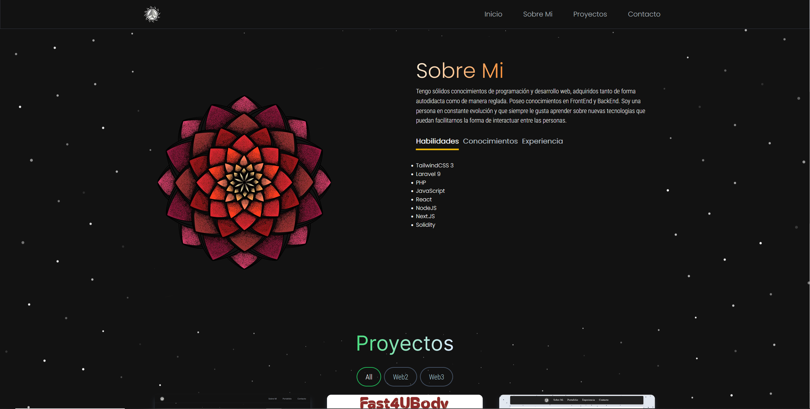
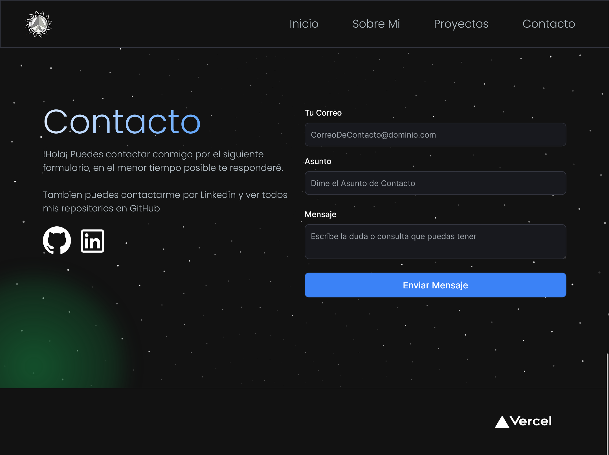

# Portafolio Web

Página web SPA de presentación personal, información sobre mi persona, proyectos creados y medios de contacto.

El apartado de Contacto es funcional y se recibe un correo de confirmación con la información proporcionada.

## **Tecnologias**

Para el portafolio utilice las siguientes tecnologias:

-  
-  
- 
- 

### Portafolio en formato Móvil, Table y Escritorio
<!-- SCREENSHOTS -->
<table>
    <tr>
      <td>
          
      </td>
      <td>
          
      </td>
      <td>
          
      </td>
    </tr>
    <tr>
      <td>
          
      </td>
      <td>
          
      </td>
      <td>
          
      </td>
    </tr>
  <tr>
      <td>
          
      </td>
      <td>
          
      </td>
      <td>
          
      </td>
    </tr>
  <tr>
      <td>
          
      </td>
      <td>
          
      </td>
      <td>
          
      </td>
    </tr>
</table>

<table>
    
</table>

## Instalación

1. Clonar el Repositorio: `git clone https://github.com/UVallejos/portafolio-web.git`
2. Navegar a la carpeta del proyecto en la terminal `cd portafolio-web`
3. Instalar Dependencias: `npm install`
    
## Uso

1. Intropducimos el comando: `npm run dev`
2. Ingresar en el navegador a la dirección `http://localhost:3000` para ver el proyecto.

## Authors

- [@UVallejos](https://github.com/UVallejos)

